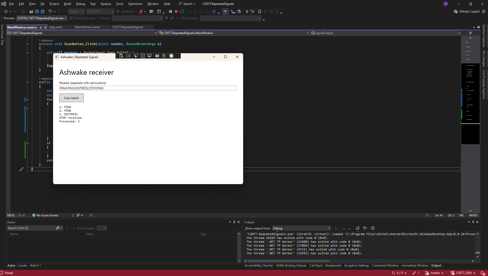
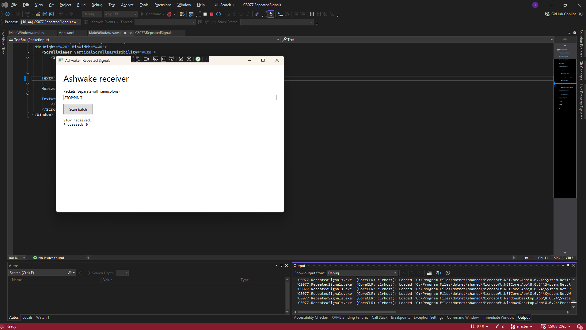
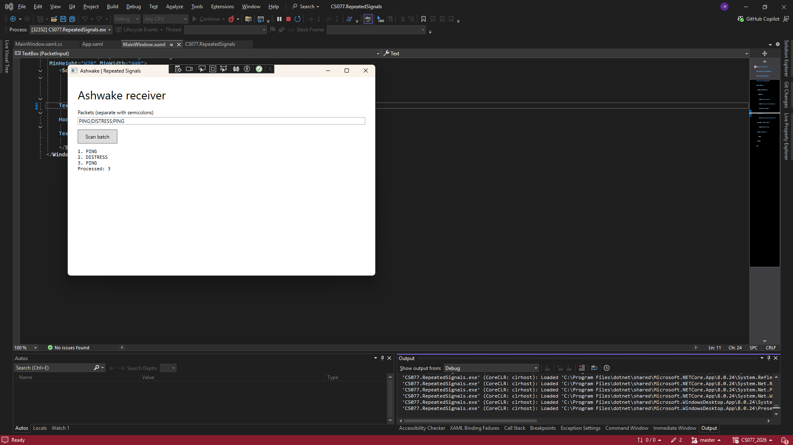
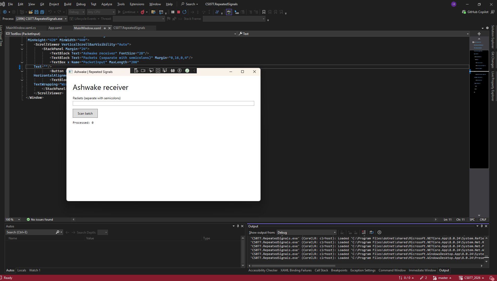
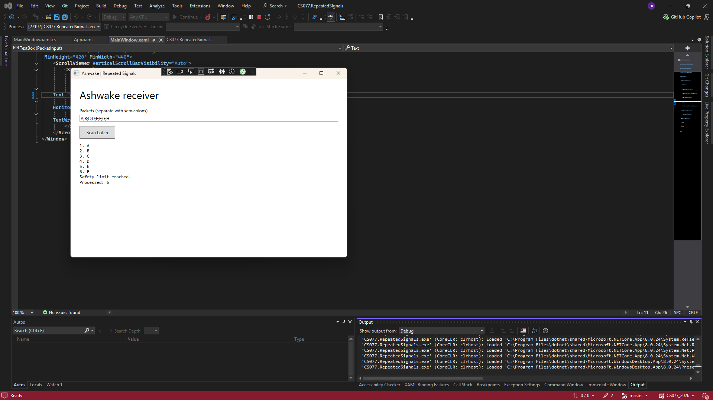
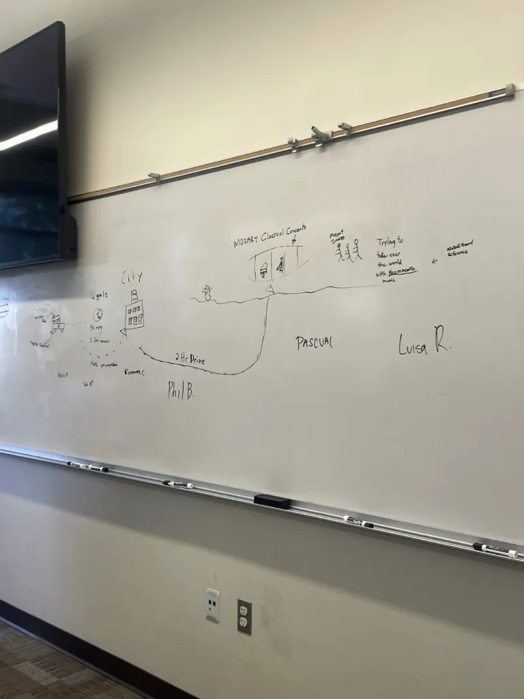
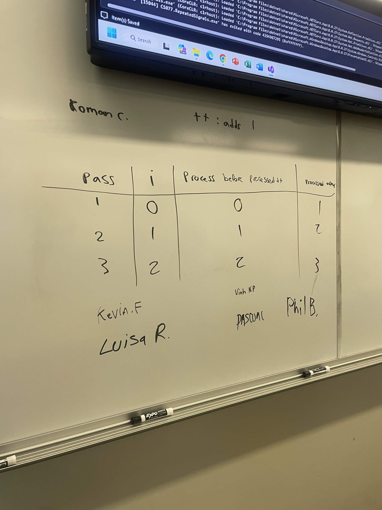

# CS077 Week 4 - Repeated Signals

This raw starter deliberately opens a plain window. Build the UI and code using the illustrated tutorial in Resources. It contains no Scan, STOP or reset implementation.

## My runner and Attention First connection
Jane needs to quickly notice a DISTRESS signal because injured members of the Dark Veil crew may need her medical help.
One interface choice that directs her attention is displaying the processed signals together in the SignalOutput area, making it easier to see what the receiver found. 
When I tested the receiver with repeated PING signals followed by DISTRESS and STOP, I saw that processing stopped once STOP was received. 
This showed me that Jane needs to pay attention to important signals before STOP because anything after it will not be processed.

## Expected and Observed Tests

I tested the receiver using the five required test cases and compared the observed results with the expected results.

### Test 1
Input: `PING;PING;DISTRESS;STOP;PING`

Expected Result: 3 packets processed; STOP received; the last PING is ignored.

Observed Result: Test 1 passed. The receiver processed the first three signals and stopped processing after STOP, ignoring the last PING.

### Test 2
Input: `STOP;PING`

Expected Result: 0 packets processed; STOP is first, so no data packet is processed.

Observed Result: Test 2 passed. The receiver immediately stopped when it received STOP, so the PING after it was not processed.

### Test 3
Input: `PING;DISTRESS;PING`

Expected Result: 3 packets processed; the end of the batch is reached without needing STOP.

Observed Result: Test 3 passed. The receiver processed all three signals and ended when there were no more packets.

### Test 4
Input: `(empty)`

Expected Result: 0 packets processed; the batch is empty, so the loop does not process any packets.

Observed Result: Test 4 passed. The receiver processed zero packets because the input was empty.

### Test 5
Input: `A;B;C;D;E;F;G;H`

Expected Result: 6 packets processed; the safety limit is reached, so G and H are not processed.

Observed Result: Test 5 passed. The receiver processed A through F and stopped at the six-packet safety limit, leaving G and H unprocessed.

## AI question, change, test result and next step
I asked the AI to help me add one reset receiver button to the UI. 
The AI suggested adding a button that calls a ResetReceiver method, which clears the processed signals and resets the receiver state. 
I implemented this change and tested it by sending a batch of signals, pressing the reset button, and then sending another batch. 
The receiver correctly reset and processed the new batch of signals.

## Whiteboard and course collaboration evidence

The whiteboard shows course collaboration and planning evidence used while working on the Repeated Signals receiver.

 

## How to run and sources

Open CS077.RepeatedSignals.csproj in Visual Studio on Windows with .NET desktop development. Press F5. Press the Scan button to send a batch of signals.
The receiver will process the signals and display the results in the SignalOutput area. Use the Reset button to clear the processed signals and reset the receiver state.
